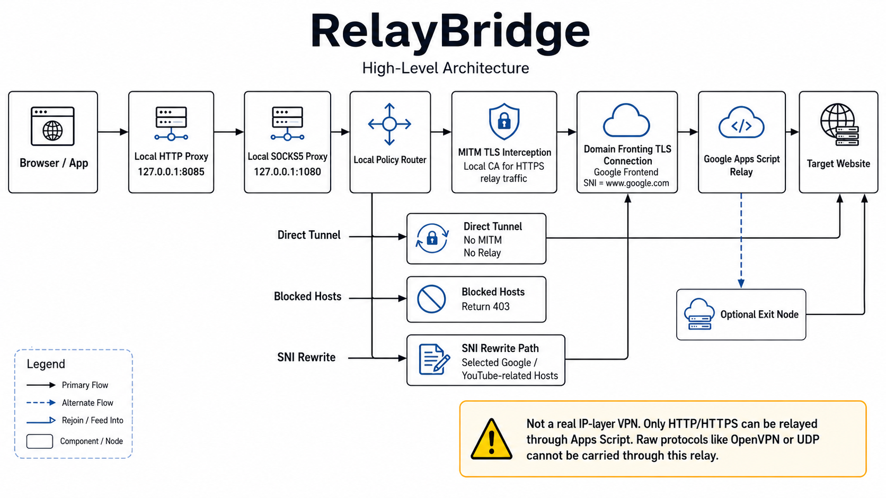

# RelayBridge

**Language:** English | [Persian](README_FA.md)

RelayBridge is a local HTTP/SOCKS5 proxy that routes web traffic through a user-owned Google Apps Script relay. It is designed for controlled testing, research, and personal proxy workflows where HTTP and HTTPS requests need to be forwarded through a Google-fronted relay path.

RelayBridge is not an IP-layer VPN. It does not carry arbitrary UDP/TCP protocols through Google Apps Script. For HTTPS relay mode, the local proxy performs TLS interception with a generated local CA, converts the browser request into a relay payload, and reconstructs the response locally.

```text
Browser or app
  -> Local HTTP/SOCKS5 proxy
  -> Google-fronted TLS connection
  -> Your Google Apps Script relay
  -> Target website
```



## What It Does

- Provides an HTTP proxy on `127.0.0.1:8085`.
- Provides a SOCKS5 proxy on `127.0.0.1:1080`.
- Relays HTTP/HTTPS web requests through Google Apps Script.
- Supports domain-fronted connections to Google frontends.
- Generates a local CA for HTTPS interception when relay mode needs decrypted HTTP requests.
- Supports direct, blocked, bypass, SNI-rewrite, and optional exit-node routing policies.
- Includes Docker, LAN sharing, configuration, troubleshooting, and exit-node documentation.

## Important Limitations

- RelayBridge is not a replacement for OpenVPN, WireGuard, or a full system VPN.
- Google Apps Script can fetch HTTP/HTTPS resources; it cannot transport arbitrary raw protocols.
- OpenVPN, SSH, UDP, and non-HTTP application protocols normally fall back to direct TCP tunneling or fail.
- HTTPS relay mode requires trusting the generated local CA on the client device.
- Heavy traffic can exhaust the Google Apps Script `URL Fetch calls` quota: currently 20,000 calls/day for consumer accounts and 100,000 calls/day for Google Workspace accounts, per user, reset 24 hours after the first request. See Google's [Apps Script quotas](https://developers.google.com/apps-script/guides/services/quotas).

## Documentation

| Topic | Link |
|-------|------|
| Getting started | [docs/GETTING_STARTED.md](docs/GETTING_STARTED.md) |
| Docker | [docs/DOCKER.md](docs/DOCKER.md) |
| Configuration | [docs/CONFIGURATION.md](docs/CONFIGURATION.md) |
| Security | [docs/SECURITY.md](docs/SECURITY.md) |
| Troubleshooting | [docs/TROUBLESHOOTING.md](docs/TROUBLESHOOTING.md) |
| LAN sharing | [docs/LAN_SHARING.md](docs/LAN_SHARING.md) |
| Architecture | [docs/ARCHITECTURE.md](docs/ARCHITECTURE.md) |
| Exit node | [docs/exit-node/EXIT_NODE_DEPLOYMENT.md](docs/exit-node/EXIT_NODE_DEPLOYMENT.md) |

## Quick Start

Before starting the local proxy, deploy the Google Apps Script relay.

1. Open [Google Apps Script](https://script.google.com/).
2. Create a new project.
3. Copy the full contents of [apps_script/Code.gs](apps_script/Code.gs) into the editor.
4. Set `AUTH_KEY` to a long random secret:

   ```javascript
   const AUTH_KEY = "your-long-random-secret";
   ```

5. Deploy as a Web App.
6. Set **Execute as** to **Me**.
7. Set **Who has access** to **Anyone**.
8. Copy the deployment ID.

Then clone and run RelayBridge:

```bash
git clone https://github.com/Hatef-Rostamkhani/RelayBridge.git
cd RelayBridge
```

On Windows:

```cmd
start.bat
```

On Linux or macOS:

```bash
chmod +x start.sh
./start.sh
```

The launcher creates a virtual environment, installs dependencies, opens the setup wizard if `config.json` is missing, and starts the proxy.

## Browser Proxy Settings

| Field | Value |
|-------|-------|
| HTTP proxy host | `127.0.0.1` |
| HTTP proxy port | `8085` |
| SOCKS5 host | `127.0.0.1` |
| SOCKS5 port | `1080` |

For HTTPS relay mode, install `ca/ca.crt` as a trusted root CA on the client device. Firefox may require importing the CA separately from its certificate settings.

## Docker

Build and run:

```bash
docker compose up -d --build
```

For local-only exposure, bind ports to loopback in `docker-compose.yml`:

```yaml
ports:
  - "127.0.0.1:8085:8085"
  - "127.0.0.1:1080:1080"
```

## Security Notes

Keep these private:

- `config.json`
- `auth_key`
- `ca/ca.key`
- the full `ca/` directory
- exit-node URLs paired with valid PSKs
- live Apps Script deployment IDs paired with a valid `auth_key`

Anyone with `ca/ca.key` can create certificates trusted by devices that trust your generated CA. If the CA private key is exposed, remove the old CA from trusted stores, delete `ca/`, generate a new CA, and reinstall the new `ca/ca.crt`.

## Legal

RelayBridge is provided for educational, testing, and research use. You are responsible for complying with applicable laws, network policies, account rules, and Google service terms.

## License

MIT License.

Copyright (c) 2026 Hatef Rostamkhani.

Original author: Amin Mahmoudi.
