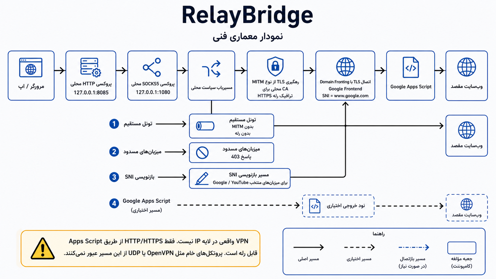

# RelayBridge

**زبان:** [English](README.md) | فارسی


<div dir="rtl" lang="fa" style="text-align: right;">
RelayBridge یک پراکسی محلی HTTP/SOCKS5 است که ترافیک وب را از مسیر یک رله Google Apps Script که خودتان deploy می‌کنید عبور می‌دهد. این پروژه برای تست، پژوهش، و استفاده شخصی طراحی شده است؛ نه برای جایگزینی کامل VPNهای سطح سیستم.

RelayBridge یک VPN واقعی در سطح IP نیست. این پروژه نمی‌تواند هر نوع TCP/UDP خام را از Google Apps Script عبور دهد. در حالت HTTPS relay، پراکسی محلی با CA تولیدشده خودش TLS را به صورت محلی intercept می‌کند، درخواست HTTP را به payload قابل ارسال به رله تبدیل می‌کند، و پاسخ را دوباره برای مرورگر بازسازی می‌کند.

```text
مرورگر یا برنامه
  -> پراکسی محلی HTTP/SOCKS5
  -> اتصال TLS به مسیر Google
  -> رله Google Apps Script شما
  -> سایت مقصد
```



## قابلیت‌ها

- پراکسی HTTP روی `127.0.0.1:8085`.
- پراکسی SOCKS5 روی `127.0.0.1:1080`.
- عبور درخواست‌های HTTP/HTTPS از Google Apps Script.
- پشتیبانی از domain fronting روی مسیرهای Google.
- ساخت CA محلی برای HTTPS interception در مسیر relay.
- سیاست‌های direct، blocked، bypass، SNI rewrite، و exit node اختیاری.
- مستندات Docker، تنظیمات، عیب‌یابی، اشتراک‌گذاری LAN، معماری، و exit node.

## محدودیت‌های مهم

<div dir="rtl" lang="fa" style="text-align: right;">

- این RelayBridge جایگزین OpenVPN، WireGuard، یا VPN کامل سیستم نیست.
- سرویس Google Apps Script فقط برای fetch کردن HTTP/HTTPS مناسب است.
- پروتکل های OpenVPN، SSH، UDP، و پروتکل‌های غیر HTTP معمولا فقط direct tunnel می‌شوند یا شکست می‌خورند.
- برای HTTPS relay باید `ca/ca.crt` را روی دستگاه client به عنوان trusted root نصب کنید.
- مصرف سنگین می‌تواند quota مربوط به `URL Fetch calls` در Google Apps Script را تمام کند: طبق مستند Google، فعلا ۲۰٬۰۰۰ call در روز برای حساب‌های معمولی و ۱۰۰٬۰۰۰ call در روز برای Google Workspace است؛ این سهمیه برای هر کاربر جداست و ۲۴ ساعت بعد از اولین request reset می‌شود. منبع: [Apps Script quotas](https://developers.google.com/apps-script/guides/services/quotas).

</div>

## مستندات

| موضوع | لینک |
|-------|------|
| شروع سریع | [docs/fa/GETTING_STARTED.md](docs/fa/GETTING_STARTED.md) |
| Docker | [docs/fa/DOCKER.md](docs/fa/DOCKER.md) |
| Android MVP | [docs/ANDROID.md](docs/ANDROID.md) |
| تنظیمات | [docs/fa/CONFIGURATION.md](docs/fa/CONFIGURATION.md) |
| امنیت | [docs/fa/SECURITY.md](docs/fa/SECURITY.md) |
| عیب‌یابی | [docs/fa/TROUBLESHOOTING.md](docs/fa/TROUBLESHOOTING.md) |
| اشتراک‌گذاری LAN | [docs/fa/LAN_SHARING.md](docs/fa/LAN_SHARING.md) |
| معماری | [docs/fa/ARCHITECTURE.md](docs/fa/ARCHITECTURE.md) |
| Exit node | [docs/exit-node/EXIT_NODE_DEPLOYMENT_FA.md](docs/exit-node/EXIT_NODE_DEPLOYMENT_FA.md) |

## شروع سریع

قبل از اجرای پراکسی محلی، باید یک رله Google Apps Script بسازید.

<ol dir="rtl" lang="fa">
  <li>وارد <a href="https://script.google.com/">Google Apps Script</a> شوید.</li>
  <li>یک پروژه جدید بسازید.</li>
  <li>محتوای کامل <a href="apps_script/Code.gs">apps_script/Code.gs</a> را داخل editor قرار دهید.</li>
  <li>
    مقدار <code>AUTH_KEY</code> را با یک secret طولانی و تصادفی جایگزین کنید:
    <pre dir="ltr"><code class="language-javascript">const AUTH_KEY = "your-long-random-secret";</code></pre>
  </li>
  <li>پروژه را به صورت Web App deploy کنید.</li>
  <li>گزینه <strong>Execute as</strong> را روی <strong>Me</strong> بگذارید.</li>
  <li>گزینه <strong>Who has access</strong> را روی <strong>Anyone</strong> بگذارید.</li>
  <li>Deployment ID را کپی کنید.</li>
</ol>

سپس پروژه را دریافت و اجرا کنید:

```bash
git clone https://github.com/Hatef-Rostamkhani/relay-bridge.git
cd relay-bridge
```

<div dir="rtl" lang="fa">

در Windows:

</div>

```cmd
start.bat
```

<div dir="rtl" lang="fa">

در Linux یا macOS:

</div>

```bash
chmod +x start.sh
./start.sh
```

<div dir="rtl" lang="fa">

لانچر virtualenv می‌سازد، وابستگی‌ها را نصب می‌کند، اگر `config.json` وجود نداشته باشد setup wizard را اجرا می‌کند، و سپس پراکسی را بالا می‌آورد.

</div>

## تنظیم پراکسی مرورگر

| گزینه | مقدار |
|-------|-------|
| HTTP proxy host | `127.0.0.1` |
| HTTP proxy port | `8085` |
| SOCKS5 host | `127.0.0.1` |
| SOCKS5 port | `1080` |

برای HTTPS relay، فایل `ca/ca.crt` را روی دستگاه client به عنوان trusted root CA نصب کنید. Firefox ممکن است نیاز داشته باشد CA را جداگانه از بخش certificate settings وارد کنید.

## Docker

ساخت و اجرا:

```bash
docker compose up -d --build
```

برای اینکه سرویس فقط روی همین سیستم در دسترس باشد، پورت‌ها را در `docker-compose.yml` به loopback محدود کنید:

```yaml
ports:
  - "127.0.0.1:8085:8085"
  - "127.0.0.1:1080:1080"
```

## نکات امنیتی

این موارد را خصوصی نگه دارید:

- `config.json`
- مقدار `auth_key`
- فایل `ca/ca.key`
- کل پوشه `ca/`
- آدرس exit node همراه با PSK معتبر
- Deployment ID فعال همراه با `auth_key` معتبر

هر کسی که به `ca/ca.key` دسترسی داشته باشد می‌تواند برای دستگاه‌هایی که CA شما را trust کرده‌اند certificate معتبر بسازد. اگر private key لو رفت، CA قبلی را از trust store حذف کنید، پوشه `ca/` را پاک کنید، CA جدید بسازید، و `ca/ca.crt` جدید را نصب کنید.

## مسئولیت استفاده

RelayBridge برای آموزش، تست، و پژوهش ارائه شده است. مسئولیت رعایت قوانین، سیاست‌های شبکه، قوانین حساب‌ها، و شرایط سرویس‌های Google با کاربر است.

## مجوز

MIT License.

Copyright (c) 2026 Hatef Rostamkhani.

نویسنده اصلی: Amin Mahmoudi.
</div>
